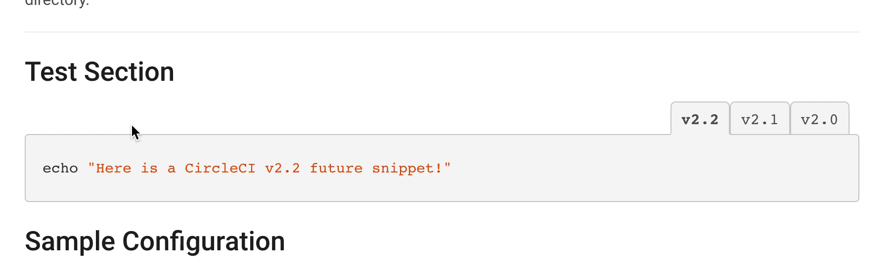
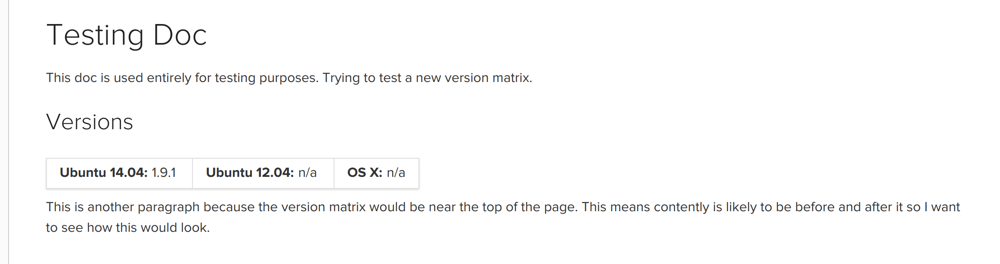

# CircleCI Docs: Widgets

Many documentation pages will have widgets. These are discrete page elements that provide advanced functionality within Markdown.

The widgets available in CircleCI.com/docs/ are:


## Tabbed Code Blocks



This allows you to create tabs in a code block to display alternate versions of something.
The example from the screenshot shows how you can use tabbed code blocks to display a CircleCI v2.1 and v2.0 config.

Here's how this would look in Jekyll's Markdown:

````
{:.codetab.1.v2_1}
```bash
echo "This is brand new CircleCI v2.1 config!"
```

{:.codetab.1.v2_0}
```bash
echo "This is 2.0 config."
```
````

After the string `codetab` you'll see the integer `1`.
This is how tabbed code blocks are group.
Everything with `1` appears together in a group.
Everything with `2` will appear in a separate group of tabs, and so on.

Periods (`.`) and spaces (` `) aren't supported in tab names.
Instead, use an underscore (`_`) and dash (`-`) respectively and they'll be rendered correctly.


## OS Version Matrix



Use this widget to display which version (if any) of some software is available on a given operating system (OS) supported by CircleCI. This only applies to CircleCI 1.0.

Version numbers can be passed as either strings or from Jekyll datafiles.

```

```

If an OS doesn’t support some software, there’s no need to pass any variable at all.

For example, if we had software that was only compatible with Ubuntu 14.04 “Trusty”, we would write:

```

```
