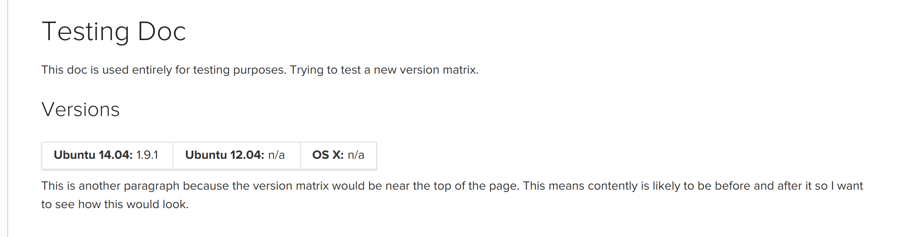

# CircleCI Docs: Widgets

Some documentation pages will have widgets. These are page elements that provide advanced functionality within Markdown.

## Tabbed HTML Elements


Tabbed HTML elements allow you to create tabs to display alternate versions of something. The example gif above shows how you can use tabbed  blocks to display different version of a screenshot between CircleCI Cloud and Server.

Here's how this would look in Jekyll's Markdown:

```md
{:.tab.jobscreenshot.Cloud}


{:.tab.jobscreenshot.Server}

```

Using the example line `{:.tab.jobscreenshot.Cloud}`, let's look at how usage of tabs is broken down.

`.tab` creates a class called "tab"; it must be the first class.

Next, you have a string that can be (almost) anything. In this case it is `jobscreenshot`. It could just as easily be `my_code_sample`. All tabs that share this group name will be grouped together.

Finally, you have the third part of the tab classes: `Cloud`. This is the _name_ of the tab as it will appear in the UI. 

### Limitations:

Periods (`.`) and spaces (` `) aren't supported in tab names.
Instead, use an underscore (`_`) and dash (`-`) respectively and they'll be rendered correctly.


## OS Version Matrix



Use this widget to display which version (if any) of some software is available on a given operating system (OS) supported by CircleCI. This only applies to CircleCI 1.0.

Version numbers can be passed as either strings or from Jekyll datafiles.

```

```

If an OS doesn’t support some software, there’s no need to pass any variable at all.

For example, if we had software that was only compatible with Ubuntu 14.04 “Trusty”, we would write:

```

```
