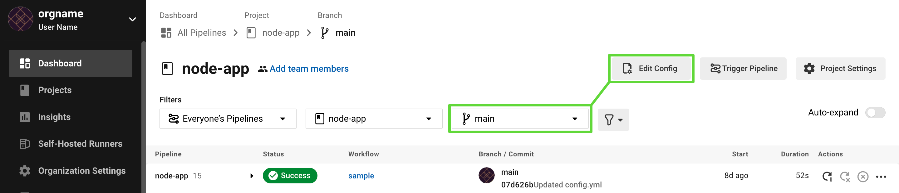
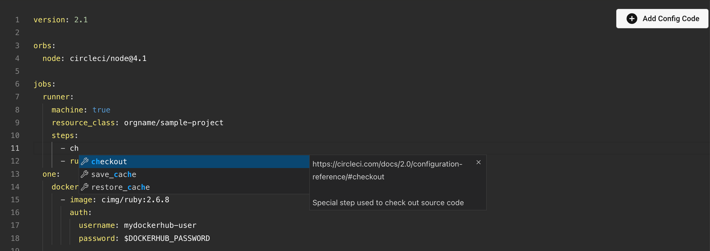
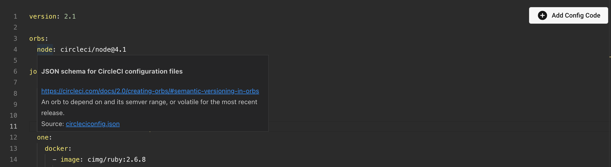

In this section, you will find an overview of the available features of using the in-app CircleCI configurqtion editor.

## Getting started with the CircleCI config editor

A UI environment is provided for users who wish to modify their configurations without the use of the 
[CircleCI CLI]({{ site.baseurl }}/2.0/local-cli/). 

In the CircleCI app, select a pipeline in the *All Pipelines* view.

To access the CircleCI Configuration Editor, select your desired branch from the *All Branches*
drop-down menu near the top of the screen.

*Config Editor Access*

Once you select a branch, the *Edit Config* button will become enabled. Click it to access the Configuration Editor.

The config editor is much like any other traditional IDE, providing line-numbers and other features.

## Autocompletion

Like many traditional IDEs, the CircleCI configuration editor will provide auto-complete suggestions as you type, as well
as any supporting documentation.

*Auto completion*

## Smart tooltips

When hovering over a CircleCI definition in your configuration file, a tooltip will appear, giving you additional information.

*Tooltips*

## Automatic validation

If using the in-app Config Editor, your configuration will be automatically validated after every change.

At the bottom of the editor, you can verify whether or not your configuration is valid.

For a valid configuration, you will see the following:

*Passing Configuration Validation*

For a failing validation, a red bar is displayed, as well as any errors, where they occur, and any relevant documentation 
that may assist in fixing the error (see the "DOCS" tab in the below screen shot).

*Failing Configuration Validation*

## Commit and run

Once your configuration is valid, you may commit to your VCS and re-run the pipeline, all from within the Config Editor,
by selecting the *Commit and Run* button in the upper-right corner.

*Commit and Run button*

## See also

[Configuring CircleCI]({{ site.baseurl }}/2.0/configuration-reference/)
[Using the CircleCI CLI]({{ site.baseurl }}/2.0/local-cli)

